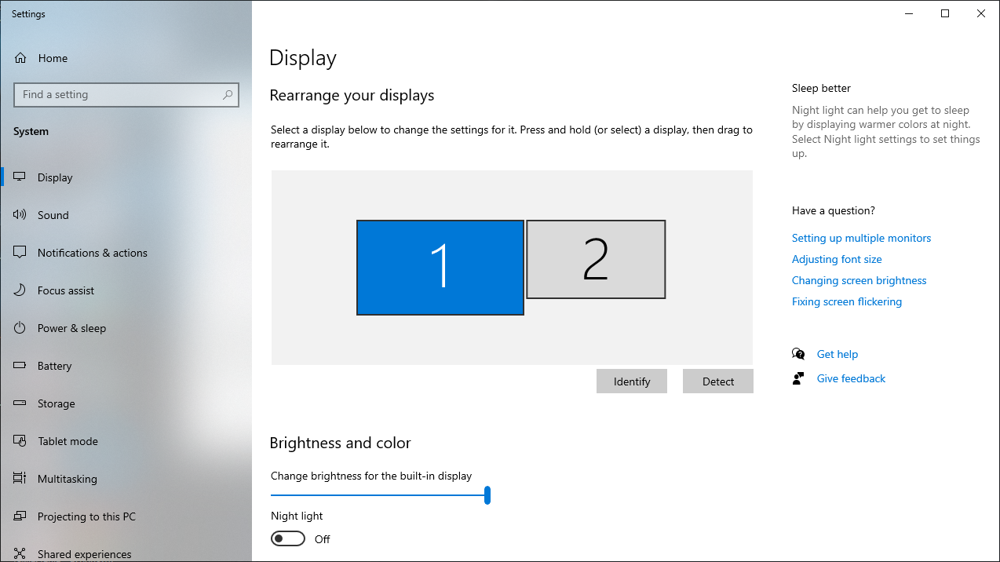

<!--Category:PowerShell--> 
 

    
    <a href="http://productivitytools.tech/pscmdlet/"><a> 
    

    

# Display position

Module allows to change position of the external display. As a bonus it returns information about displays.

<!--more-->
<!--og-image-->
 

