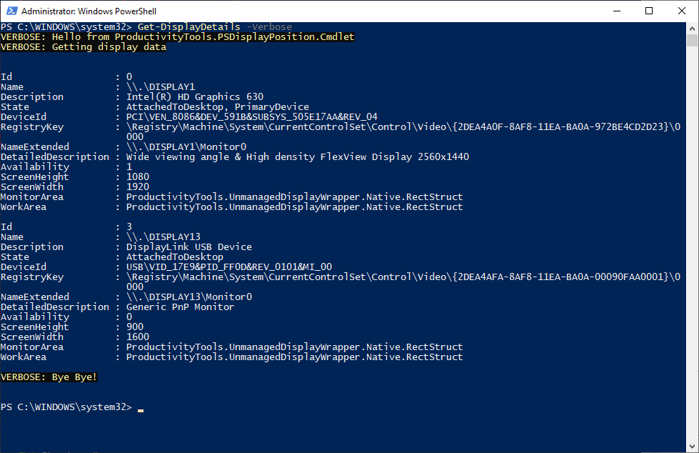

<!--Category:PowerShell--> 
 <p align="right">
    <a href="https://www.powershellgallery.com/packages/ProductivityTools.PSDisplayPosition/"></a>
    <a href="http://www.productivitytools.tech/display-position/"><a> 
    <a href="https://github.com/pwujczyk/ProductivityTools.PSDisplayPosition"></a>
</p>
<p align="center">
    <a href="http://http://productivitytools.tech/">
        
    </a>
</p>

# Display position

Module allows to change position of the external display. Additionally it returns information about displays.

<!--more-->
<!--og-image-->
 

Main cmdlet doesn't return any information it just move screen to the chosen side.

```PowerShell
Move-ExternalDisplayToRight -Verbose
```

 

Getting details of the display returns information about all connected devices.

```PowerShell
Get-DisplayDetails -Verbose
```

 


